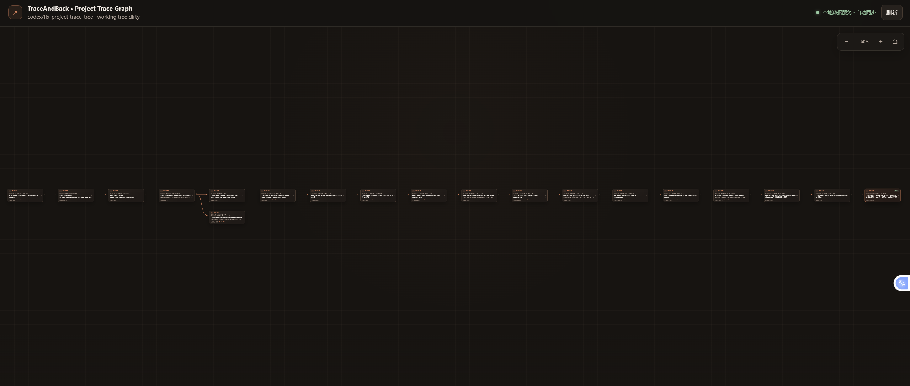
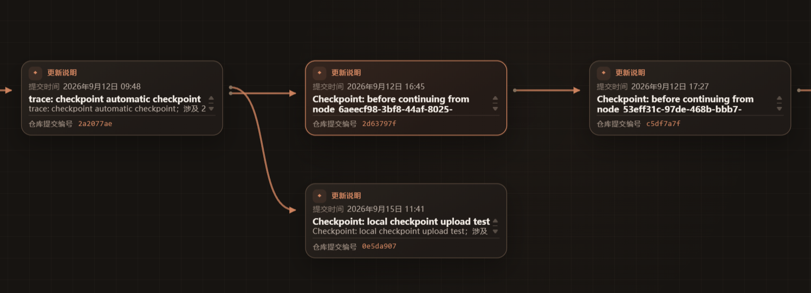
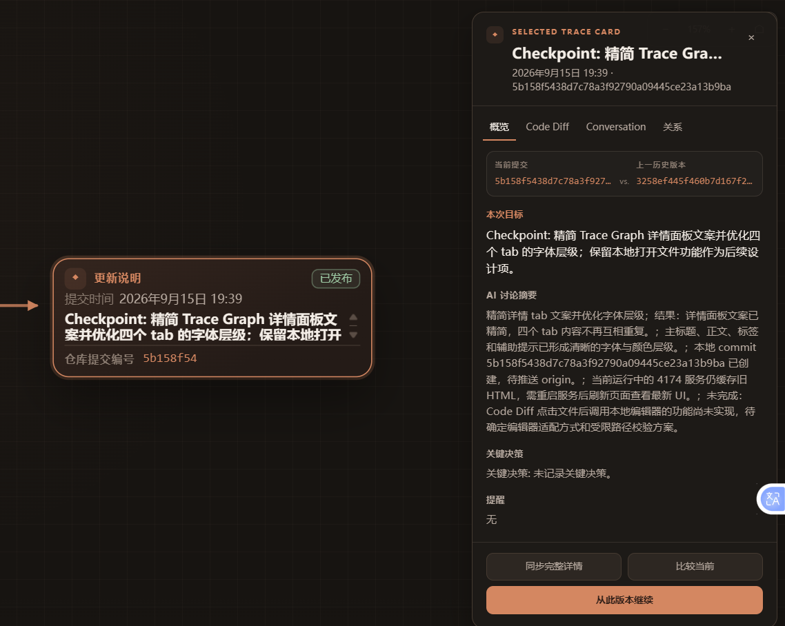

<div align="center">

# Pastlane

### Git remembers what changed. Pastlane remembers how you got there.

A local-first development timeline for AI-assisted coding, built on **Git**, **MCP**, and structured **AI collaboration summaries**.


</div>

---

## Overview

Pastlane is a **project-scoped development timeline** for AI-assisted coding.

It combines:

- **Git-backed Trace Nodes**
- **recoverable local checkpoints**
- **safe continuation from historical versions**
- **structured AI collaboration summaries**
- a browser-based **Trace Graph UI**
- **local-first** persistence through SQLite

Instead of only showing _what changed_, Pastlane helps you understand:

- what you were trying to do
- how a version evolved
- why a decision was made
- what remains unresolved
- where it is safe to continue from

---

## See the evolution of your project

Pastlane turns repository history into a visual **Trace Graph**.

You can inspect branches, checkpoints, and continuation paths across a project timeline.

<p align="center">
  
</p>

<p align="center">
  
</p>

---

## Understand the context behind every version

Every Trace Node can include more than just a commit.

You can inspect:

- development goal
- AI collaboration summary
- code diff
- node relationships
- unresolved items
- key decisions

<p align="center">
  
</p>

The current browser experience is designed around a full-canvas project view:

- Git ancestry is shown with explicit direction markers, including parallel branches.
- The current remote publication is marked separately from the selected Trace Node.
- Repository status is monitored automatically, while manual refresh remains available.
- The detail panel provides **Overview**, **Code Diff**, **Conversation**, and **Relations** tabs.
- The initial graph loads a compact summary; changed files and collaboration context are fetched when a node's full details are requested.

---

## Why Pastlane

AI coding tools are great at helping with the **current task**, but over time it becomes hard to answer:

- Which checkpoint should I continue from?
- What changed between these two versions?
- What was the goal of this checkpoint?
- What did the AI and human decide here?
- Which branch represents the safer continuation path?

Pastlane solves that by combining **code history + version context + safe recovery**.

---

## Core Features

### 1. Project-scoped Trace Graph

Pastlane builds an interactive graph for the current repository, instead of mixing unrelated projects together.

Each Trace Node can include:

- Git commit reference
- parent relations
- changed-file details
- addition/deletion statistics
- development goal
- AI summary
- key decisions
- unresolved items

### 2. Recoverable local checkpoints

Create a checkpoint from visible work and persist it as a Trace Node backed by Git.

```text
Working tree
    ↓
Checkpoint
    ↓
Git commit
    ↓
Trace Node
```

This keeps recovery understandable and verifiable.

### 3. Safe continuation from history

Resume from a historical Trace Node through either:

- **branch** — continue inside the current repository via a new trace branch
- **worktree** — continue in a separate verified worktree

This avoids destructive history rewrites and makes experimentation safer.

### 4. Structured AI collaboration summaries

Pastlane supports host-generated `WorkTraceSummary` persistence.

That means an AI host can summarize the current visible development session and attach structured context to a Trace Node without exporting hidden reasoning or raw internal chain-of-thought.

Typical summary content includes:

- title
- goal
- outcomes
- unresolved items
- key decisions
- affected files or areas

### 5. Browser-based Trace Graph UI

Pastlane provides an interactive browser UI through MCP so you can:

- inspect project history visually
- select nodes
- compare versions
- view summaries and diffs
- continue from earlier versions safely

The browser starts with a lightweight graph payload so larger histories open quickly. Use **Sync full details** on a selected card when you need changed-file statistics or the full collaboration summary. The complete `trace.render_graph` response remains available for integrations that need all node details immediately.

---

## Requirements

Before installing, make sure you have:

- **Node.js 24 or newer**
- **pnpm 11**
- **Git**

Check your environment:

```bash
node --version
pnpm --version
git --version
```

If pnpm is missing:

```bash
npm install -g pnpm@11
```

---

## Installation

### 1. Clone the repository

```bash
git clone https://github.com/Me10dy66666666/Trace.git
cd Trace
```

If your workflow requires a specific branch, list the available branches first:

```bash
git branch --all
git switch <branch-name>
```

### 2. Install dependencies

```bash
pnpm install
```

### 3. Verify the project

```bash
pnpm check
pnpm test
```

---

## Run

Start the MCP server and local Trace Graph browser service:

```bash
pnpm trace:start
```

You can also use:

```bash
pnpm start
```

The bundled MCP configuration lives in:

```text
.mcp.json
```

---

## Quick Start

1. Start Pastlane
2. Connect it to your MCP-compatible host
3. Open the graph with `trace.start`
4. Inspect repository status, history, branches, and the current published marker
5. Select a Trace Node and sync its full details when needed
6. Compare versions or create a checkpoint
7. Persist a structured work summary and resume from any earlier Trace Node when needed

---

## MCP Tools

### Graph & inspection

| Tool | Description |
| --- | --- |
| `trace.start` | Start the current project's lightweight Trace Graph and return a browser-openable URL. |
| `trace.render_graph` | Render the complete Trace Graph for a specific repository or repository ID. |
| `trace.get_status` | Inspect the repository and return Pastlane status. |
| `trace.get_history` | Return Trace timeline history. |
| `trace.get_node` | Return a Trace Node's detailed information. |
| `trace.compare` | Compare two Trace Nodes through verified Git commits. |

### Checkpoints & recovery

| Tool | Description |
| --- | --- |
| `trace.create_checkpoint` | Create a recoverable local checkpoint from visible working-tree changes. |
| `trace.resume_from` | Continue from a historical Trace Node using a branch or worktree strategy. |

### Conversation & summaries

| Tool | Description |
| --- | --- |
| `trace.attach_conversation` | Attach a local provider and conversation reference to a Trace Session. |
| `trace_finalize_session` | Persist a host-generated `WorkTraceSummary` for a session. |
| `trace_finalize_commit` | Persist a summary for a verified commit, creating the Trace Node when needed. |
| `trace_update_summary` | Replace the structured summary of an existing Trace Node. |

---

## MCP Configuration

Example `.mcp.json`:

```json
{
  "mcpServers": {
    "traceandback": {
      "command": "node",
      "args": ["--import", "tsx", "src/cli.ts", "start"]
    }
  }
}
```

The simplest entry point is:

```text
trace.start
```

---

## WorkTrace Finalizer

This repository includes a host-side skill package:

```text
skills/traceandback-worktrace-finalizer/
```

Its job is to summarize the **current visible human–AI development session** and persist a structured `WorkTraceSummary` into Pastlane.

This separation keeps responsibilities clear:

- **Pastlane Core** → Git, checkpoints, node state, persistence, recovery
- **Host-side skill** → summarize the visible collaboration session

---

## Configuration

Optional environment variables:

### Database path

```bash
TRACEANDBACK_DATABASE_PATH=/path/to/trace.sqlite
```

### Fixed browser port

```bash
TRACEANDBACK_BROWSER_PORT=4173
```

### Browser token

```bash
TRACEANDBACK_BROWSER_TOKEN=your-token
```

If not provided, a token is generated automatically.

---

## Project Structure

```text
Trace/
├── .codex-plugin/
│   └── plugin.json
├── .mcp.json
├── docs/
│   └── assets/
│       ├── trace-graph-branching.png
│       ├── trace-graph-overview.png
│       └── trace-node-detail.png
├── skills/
│   └── traceandback-worktrace-finalizer/
├── src/
│   ├── application/
│   │   └── trace-service.ts
│   ├── domain/
│   ├── infrastructure/
│   │   ├── git-cli.ts
│   │   ├── repository-lock-manager.ts
│   │   ├── filesystem-secret-scanner.ts
│   │   └── sqlite-trace-store.ts
│   ├── mcp/
│   │   ├── create-trace-mcp-server.ts
│   │   ├── trace-graph-browser-server.ts
│   │   ├── trace-graph-app.html
│   │   └── trace-graph-launcher.html
│   └── cli.ts
├── prototype/
├── test/
├── package.json
└── README.md
```

---

## Design Principles

Pastlane is built around a few core ideas:

- **Project-scoped** — each repository has its own trace timeline
- **Git-backed** — recovery is based on real commits, not opaque snapshots
- **Local-first** — repository operations and metadata stay on your machine
- **Recoverable** — continuation creates safe new paths instead of overwriting history
- **Host-generated AI context** — summaries come from the host's visible context, not from storing hidden reasoning

---

## Project Status

Pastlane is currently an early-stage `0.1.0` project.

- repository: public
- package: currently private / unpublished
- license: not added yet

---

<div align="center">

**Trace your project history. Preserve the context. Continue from anywhere.**

</div>
